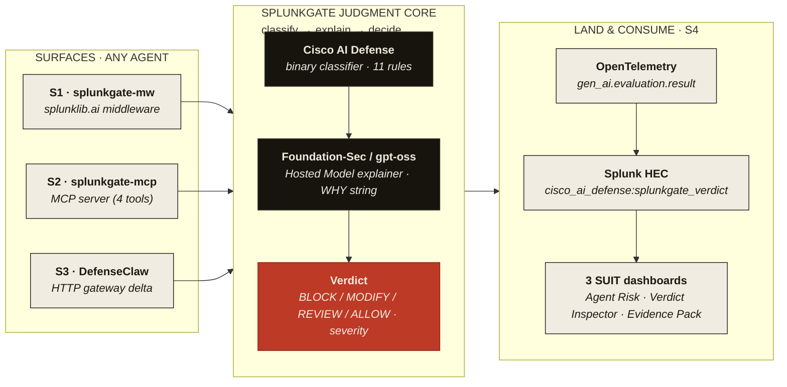
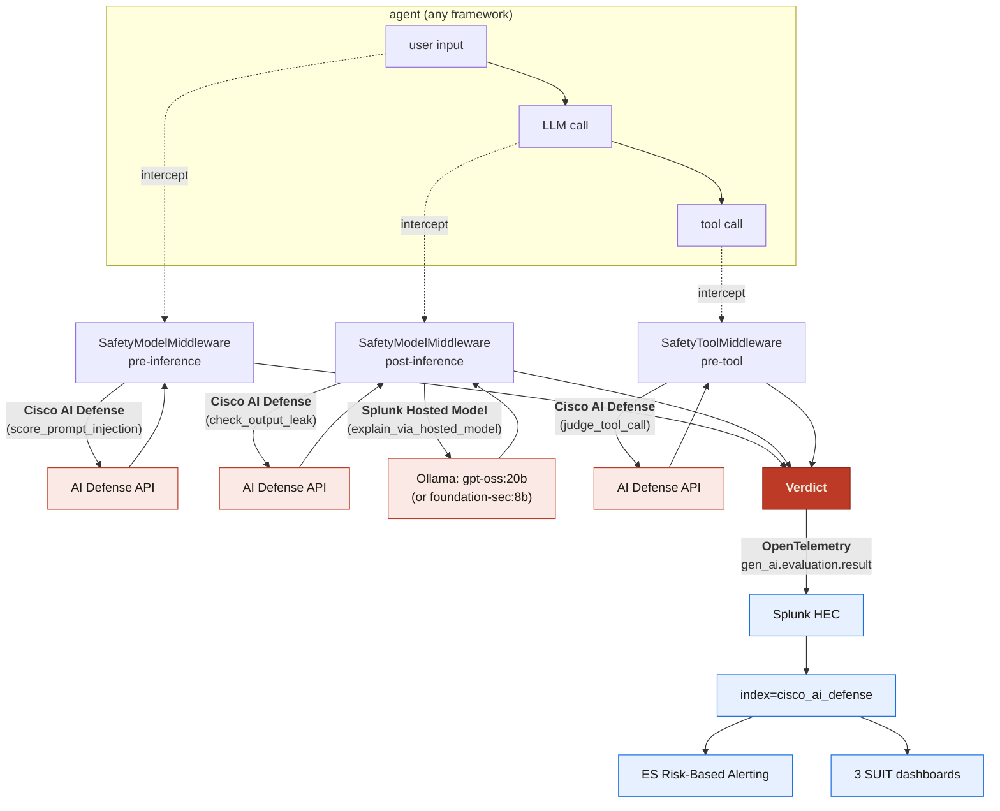
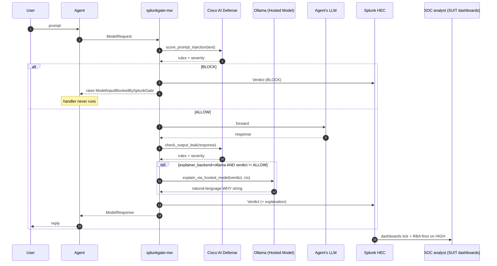

# SplunkGate — Architecture Diagram

> **Title:** How a verdict travels
> **Subtitle:** agent → judgment → verdict → OpenTelemetry → Splunk
>
> This file lives at the repo root to satisfy the Devpost submission
> requirement (`architecture_diagram.(md|pdf|png)` at repository root).
> The canonical visual reference is the Brand Kit's `id="art-arch"`
> SVG; this Markdown version is rendered for GitHub + the Devpost form.
> The accompanying SVG export will land at `docs/assets/architecture.svg`
> (see `docs/design/architecture-diagram-brief.md`).

## How SplunkGate interacts with Splunk

## Where AI integrates

## Data flow between services

## Splunk capabilities this project leverages

| # | Capability | How SplunkGate uses it |
|---|---|---|
| 1 | **Splunk Python SDK / AI for Splunk Apps** | Surface 1 wraps `splunklib.ai` agents at all 4 middleware boundaries (tool / subagent / model / agent). |
| 2 | **Splunk MCP Server** | Coexistence with Splunkbase app 7931 — SplunkGate ships its own MCP server (4 safety tools) alongside Splunk's data-query server in one Claude Desktop config (`examples/mcp-clients/claude-desktop-config.json`). |
| 3 | **Splunk Hosted Models** | Real LLM verdict explanations via Ollama-served Hosted Models (default `gpt-oss:20b`, Apache-2.0; `foundation-sec:8b` is a one-config-flag swap once a Modelfile is built). See `scripts/setup_hosted_models.sh` and ADR-003a Transport B-Ollama. |
| 4 | **Splunk Developer Tools (AppInspect)** | The Splunk app passes AppInspect cleanly on every CI run. Build artifact is byte-deterministic across machines. |

## Cross-references

- Full architecture rationale + every ADR: `docs/architecture.md`
- Designer brief for the SVG render: `docs/design/architecture-diagram-brief.md`
- Hosted Models integration walkthrough: `docs/integrations/hosted-models.md`
- MCP coexistence example: `examples/mcp-clients/`
- Hackathon-resource cross-reference audit: `docs/audits/2026-06-11-hackathon-resource-audit.md`

---

*Apache-2.0 · Splunk Agentic Ops Hackathon 2026 · https://github.com/Blockchain-Oracle/splunkgate*
